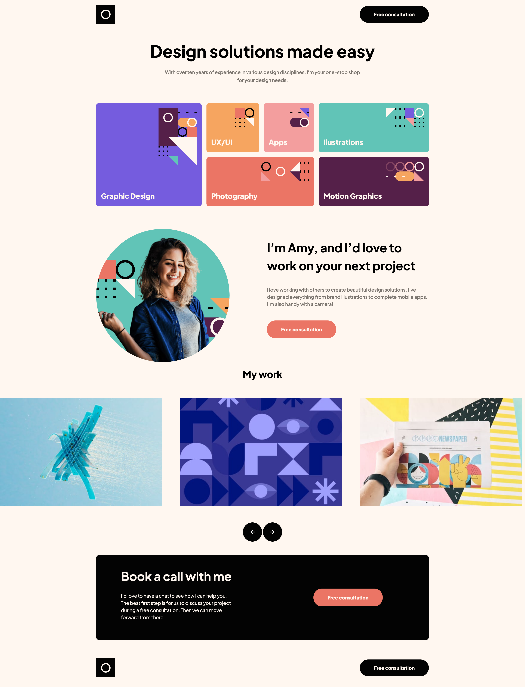

# Frontend Mentor - Single-page design portfolio solution

This is a solution to the [Single-page design portfolio challenge on Frontend Mentor](https://www.frontendmentor.io/challenges/singlepage-design-portfolio-2MMhyhfKVo). Frontend Mentor challenges help you improve your coding skills by building realistic projects.

In this project, I explored the creation of a functional gallery utilizing the new tool, Swiper, which prioritizes accessibility (a11y). Through this endeavor, I aimed to deepen my understanding of exceptional user experiences and inclusive design principles.

## Table of contents

- [Overview](#overview)
  - [The challenge](#the-challenge)
  - [Screenshot](#screenshot)
  - [Links](#links)
- [My process](#my-process)
  - [Built with](#built-with)
  - [What I learned](#what-i-learned)
  - [Useful resources](#useful-resources)
- [Author](#author)

## Overview

This project provided me with invaluable insights into the intricacies of creating user-centric galleries. Through the incorporation of custom animations, I have not only expanded my technical skill set but also enriched the overall usability and appeal of the project. I introduced several bespoke animations to imbue the project with a dynamic and visually appealing flair. These animations not only enhance the aesthetic appeal but also contribute to a more engaging user experience.

### The challenge

Users should be able to:

- View the optimal layout for the site depending on their device's screen size
- See hover states for all interactive elements on the page
- See some enjoyable CSS animations

### Screenshot



### Links

- Solution URL: [Demo](https://github.com/Patrycja-dz/Single-page-design-portfolio)
- Live Site URL: [Github](https://patrycja-dz.github.io/Single-page-design-portfolio/)

## My process

### Built with

- Semantic HTML5 markup
- CSS custom properties
- Flexbox
- CSS Grid
- CSS animations
- Mobile-first workflow
- [Vite](https://vitejs.dev/) - Frontend tooling

### What I learned

Through this endeavor, I aimed to deepen my understanding of exceptional user experiences and inclusive design principles. Also project allowed me to better understand gris-areas.

```html
<h1>Some HTML code I'm proud of</h1>
```

```css and its transitions
.person-container__background {
  position: absolute;
  aspect-ratio: 1/1;
  object-fit: cover;
  inset: auto 0 0;
}
.person-container__avatar {
  position: relative;
  z-index: 2;
  overflow: hidden;
  aspect-ratio: 1/1;
  transition: transform 450ms ease-in-out;
}
.person-container__avatar:hover {
  transform: scale(1.1);
}
```

### Useful resources

- [Resource 1](https://www.youtube.com/watch?v=1zDRqHifoX0) - This helped me for creation of an animated pop-out effect. I really liked this pattern and will use it going forward if possible.

## Author

- Frontend Mentor - [@Patrycja](https://www.frontendmentor.io/profile/Patrycja-dz)
